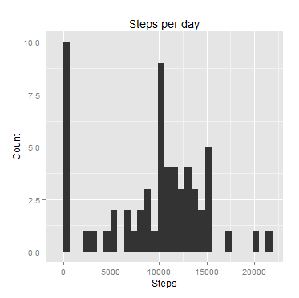
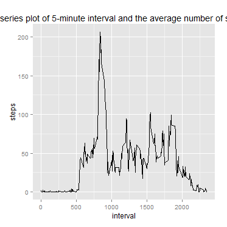
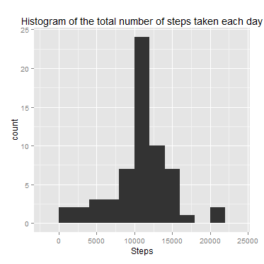
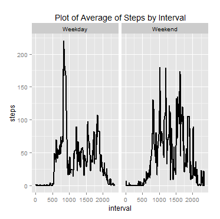

## Loading and preprocessing the data
```{r loading}
##load data by using read.csv
data <- read.csv("activity.csv")

##convert date into Date format
data$date <- as.Date(data$date)
```

## What is mean total number of steps taken per day?
```{r steps, ECHO=TRUE}
##1. Calculate the total number of steps taken per day
stepsPerDay <- aggregate(x = data$steps , by = list(data$date), FUN = sum ,na.rm=TRUE)
names(stepsPerDay) <- c("date", "steps")

##2. If you do not understand the difference between a histogram and a barplot, research the difference between them. Make a histogram of the total number of steps taken each day
hist <- qplot(stepsPerDay$steps, 
      geom="histogram",
      main= "Steps per day",
      xlab="Steps",
      ylab="Count")


```      
 
```{r mean, ECHO=TRUE}
Calculate and report the mean and median of the total number of steps taken per day
mean(stepsPerDay$steps , na.rm = TRUE)
```
[1] 9354.23


```{r median, ECHO=TRUE}
median(stepsPerDay$steps , na.rm = TRUE)
```
[1] 10395


## What is the average daily activity pattern?

```{r dailyactivity, ECHO=TRUE}
##Make a time series plot (i.e. type = "l") of the 5-minute interval (x-axis) and the average number of steps taken, averaged across all days (y-axis)

avgStepsPerDay <- aggregate(x = data$steps , by = list(data$interval), FUN = mean ,na.rm=TRUE)
names(avgStepsPerDay) <- c("interval", "steps")

ggplot(avgStepsPerDay,aes(interval,steps)) +
        ggtitle("Time series plot of 5-minute interval and the average number of steps taken") +
        geom_line()

```

 

## Imputing missing values

```{r}
# number of missing values
nrow(data[is.na(data$steps),])
```

```
## [1] 2304
```

```{r}
##Create a new dataset that is equal to the original dataset but with the missing data filled in
dataimputed <- merge(x = data, y = avgStepsPerDay , by = "interval", all.x = TRUE)
dataimputed[is.na(dataimputed$steps.x),c("steps.x")] <- dataimputed[is.na(dataimputed$steps.x),c("steps.y")]

dataimputed$steps <- dataimputed$steps.x
dataimputed$date <- as.Date(dataimputed$date)

##Make a histogram of the total number of steps taken each day
totalStepsPerDay <- aggregate(x = dataimputed$steps , by = list(dataimputed$date), FUN = sum ,na.rm=TRUE)
names(totalStepsPerDay) <- c("date","steps")
ggplot(totalStepsPerDay,aes(x = steps)) +
        ggtitle("Histogram of the total number of steps taken each day") +
        xlab("Steps") +
        geom_histogram(binwidth = 2000)
```

 

## Are there differences in activity patterns between weekdays and weekends? In spanish in my computer
```{r}
##Create a new factor variable in the dataset with two levels – “weekday” and “weekend”
dataimputed$weekday <- as.factor(ifelse(weekdays(dataimputed$date) %in% c("sabado","domingo"), "Weekend", "Weekday"))
avgStepsWeekdayWeekend <- aggregate(x = dataimputed$steps ,   
    by = list(dataimputed$interval,dataimputed$weekday), FUN = mean ,na.rm=TRUE)
names(avgStepsWeekdayWeekend ) <- c("interval","weekday","steps")

##Make a panel plot containing a time series plot 
ggplot(avgStepsWeekdayWeekend,aes(interval,steps)) +
        ggtitle("Plot of Average of Steps by Interval") +
        facet_grid(. ~ weekday) +
        geom_line(size = 1)

```
 
